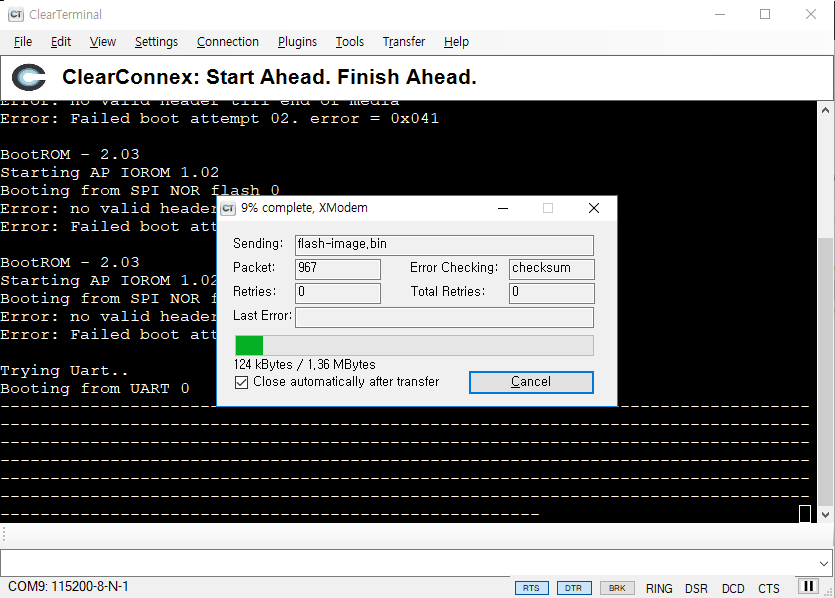

# **Marvell armada 7040 SoC 의 BSP 작업 기록**

> update : Nov 9 2018  
> author : doexercise@naver.com

&nbsp;

## **작업환경**

- **OS**  : ubuntu 18.04, VirtualBox VM  
- **SDK** : 2018 September (18.09.4) from Marvell  
- **Required packages** : libssl-dev device-tree-compiler swig libpython-dev bison flex libncurses-dev curl git
    ```shell
    root@buildsrv# apt-get install libssl-dev device-tree-compiler swig libpython-dev bison flex libncurses-dev curl
    ```

- 기본적인 작업내용은 `Armada 70x0 -> Software -> 2018 September (18.9.4) -> Documentation -> a80x0-a70x0-a39xx-a37xx-a38x-devel-18.09.4-docs.zip` 에 들어있다. 이 파일을 압축해제하고 `index.html` 을 실행하라.

&nbsp;

## **Cross Compiler 설치**

1. 빌드서버에 파일 복사
    - 파일 위치 : *Armada 70x0 -> Software -> 2018 September (18.9.4) -> SDK Components -> Toolchain -> gcc-7.3.1-linaro-2018.05*
    - 위 위치에서 압축 파일을 풀어 `gcc-linaro-7.3.1-2018.05-x86_64_aarch64-linux-gnu.tar.xz` 파일을 빌드시스템에 복사

2. 압축해제 및 PATH 설정
    ```shell
    root@buildsrv# xz -d gcc-linaro-7.3.1-2018.05-x86_64_aarch64-linux-gnu.tar.xz
    root@buildsrv# tar xf gcc-linaro-7.3.1-2018.05-x86_64_aarch64-linux-gnu.tar
    root@buildsrv# ln -s gcc-linaro-7.3.1-2018.05-x86_64_aarch64-linux-gnu toolchain
    root@buildsrv# export CROSS_COMPILE=/root/toolchain/bin/aarch64-linux-gnu-
    ```

&nbsp;

## **U-Boot**

### **Getting u-boot source**

1. Marvell 에서 제공하는 소스 파일을 사용하는 방법
    - 파일 위치 : *Armada 70x0 -> Software -> 2018 September (18.9.4) -> SDK Components -> Firmware & Boot Loaders -> U-Boot* 에서 `bootloaders-sources-standalone-18.09.4.zip` 과 `bootloaders-git-standalone-18.09.4.zip` 을 다운로드 하고 빌드 서버로 복사
    - 파일을 복사/압축해제 하고 패치한다.
        ```shell
        root@buildsrv# mkdir -p uboot/src
        root@buildsrv# mkdir -p uboot/patch
        root@buildsrv# unzip -d uboot/src bootloaders-sources-standalone-18.09.4.zip
        root@buildsrv# unzip -d uboot/patch bootloaders-git-standalone-18.09.4.zip
        root@buildsrv# cd uboot/src
        root@buildsrv# git init
        root@buildsrv# git add .
        root@buildsrv# git commit -m "init"
        root@buildsrv# git am ../patch/*.patch
        ```

2. git 을 이용하는 방법
    - Marvell 에서 제공하는 패치 파일을 복사/압축해제한다. 패치 파일 위치는 `/root/uboot-patch` 가 될 것이다.
        ```shell
        root@buildsrv# unzip -d uboot-patch bootloaders-git-standalone-18.09.4.zip
        ```
    - git 을 이용하여 소스를 다운로드 한다
        ```shell
        root@buildsrv# git clone git://git.denx.de/u-boot.git
        root@buildsrv# mv u-boot u-boot-2018.03-18.09.4
        root@buildsrv# cd u-boot-2018.03-18.09-4
        root@buildsrv# git checkout v2018.03 -b marvell-18.09.4
        ```
    - 패치한다
        ```shell
        root@buildsrv# cd u-boot-2018.03-18.09.4
        root@buildsrv# git am -3 /root/uboot-patch/*.patch
        ```

### **device tree 수정**

1. custom board 에 맞게 device tree 를 수정한다.
2. device tree 는 `<uboot-source-dir>/arch/arm/dts/armada-7040-db.dts` 에 있다.

### **u-boot build**

1. `CROSS_COMPILE` 환경변수가 설정되었다면 빌드한다.
    ```shell
    root@buildsrv# cd <path-to-uboot-source>
    root@buildsrv# make mrproper
    root@buildsrv# make mvebu_db_armada8k_defconfig
    root@buildsrv# make DEVICE_TREE=armada-7040-db
    ```
2. custom device tree 를 사용한다면 위 작업 중 `DEVICE_TREE=` 부분에 적절한 이름을 넣는다.  
3. 우리가 사용할 결과물은 소스 디렉토리 최상단의 `u-boot.bin` 파일이다.

&nbsp;

## **ATF (Arm-Trusted-Firmware)**

### **개요**

  왜 ATF가 생겨났는가? 그런 자세한 내용은 인터넷을 찾아보자. 사실 나는 배경지식 없다보니 찾아봐도 뭔 소린지 잘 모르겠다. 어쨌든 이제 그냥 부트로더를 올릴 수가 없고 ATF 로 `u-boot.bin` 을 빌드해서 올려야 한다. 여기서는 그 절차를 설명한다.

### **다운로드**

1. ATF  
    - 지금 사용하는 Marvell SDK 는 ATF V1.5 를 기반으로 되어 있다. 이 버전은 아래 링크에서 확인할 수 있다.
        > https://github.com/ARM-software/arm-trusted-firmware/tree/v1.5  
    - 다만, marvell document 에서는 아래와 같은 방법으로 안내하고 있다.
        ```shell
        root@buildsrv# git clone https://github.com/ARM-software/arm-trusted-firmware.git
        root@buildsrv# cd arm-trusted-firmware
        root@buildsrv# git checkout 7f6d8f49 -b marvell-18.09.4
        ```
    - marvell 에서 제공하는 `git-atf-v1.5-armada-18.09.4.zip` 으로 패치한다.
        ```shell
        root@buildsrv# cd <path-to-atf-source>
        root@buildsrv# unzip -d patch git-atf-v1.5-armada-18.09.4.zip
        root@buildsrv# git am -3 patch/*.patch
        ```

2. mv_ddr
    - A7K/A8K 의 경우 atf를 빌드하기 위해서 `MV_DDR_PATH=` 환경변수를 지정해야 한다. 여기에 사용할 mv_ddr 소스 파일과 디렉토리를 생성한다.
    - 두가지 방법이 있다. 하나는 `sources-mv_ddr-armada-18.09.2.zip` 파일을 풀거나, 또는 `git-mv_ddr-armada-18.09.2.zip` 파일을 이용하여 파일을 생성하는 것이다. 여기서는 후자를 이용하는 방법을 기술한다. 이 방법은 `*.patch` 파일을 이용하여 빈 디렉토리에 소스 파일을 생성하는 것이다.
        ```shell
        root@buildsrv# mkdir mv_ddr_src
        root@buildsrv# cd mv_ddr_src
        root@buildsrv# unzip -d mv_ddr_git git-mv_ddr-armada-18.09.2.zip
        root@buildsrv# git init
        root@buildsrv# git am mv_ddr_git/*.patch
        ```

### **ATF build**

1. set path for `CROSS_COMPILER`
    ```shell
    root@buildsrv# export CROSS_COMPILE=/root/toolchain/bin/aarch64-linux-gnu-
    ```

2. set path for `u-boot.bin`
    ```shell
    root@buildsrv# export BL33=/root/u-boot/src/u-boot.bin
    ```

3. set path for mss/scp image  
    - 문서에 따르면 A80x0, A8xxy 만 해당된다고 되어 있으나 A70x0 도 이것이 필요한 듯 하다.
    - 현재 파일명은 `mrvl_scp_bl2_mss_ap_cp1.img`이고, *Armada 70x0 -> Software -> 2018 September (18.9.4) -> SDK Components -> Firmware & Boot Loaders -> Firmware* 에 zip 파일로 게시되어 있다.
    ``` shell
    root@buildsrv# export SCP_BL2=/root/firmware/mrvl_scp_bl2*.img
    ```

4. set path for MV_DDR
    ```shell
    root@buildsrv# export MV_DDR_PATH=/root/mv_ddr_src
    ```

5. build
    ```shell
    root@buildsrv# make distclean
    root@buildsrv# make DEBUG=1 USE_COHERENT_MEM=0 LOG_LEVEL=20 SECURE=0 PLAT=a70x0 all fip
    ```
    > 세부적인 빌드 옵션은 https://github.com/ARM-software/arm-trusted-firmware/blob/v1.5/docs/user-guide.rst 을 참고하라.

    우리가 필요한 결과물은 **`<path-to-source>/build/a70x0/debug/flash-image.bin`** 이다.

&nbsp;

## **Linux Kernel**

### **Getting kernel source**

```shell
root@buildsrv# wget https://mirrors.edge.kernel.org/pub/linux/kernel/v4.x/linux-4.14.22.tar.xz
root@buildsrv# xz -d linux-4.14.22.tar.xz
root@buildsrv# tar xf linux-4.14.22.tar  # linux-4.14.22 디렉토리 생성됨
```

### **kernel patch**

- marvell 에서 제공하는 `git-linux-4.14.22-armada-18.09.3.zip` 파일을 이용한다.
    ```shell
    root@buildsrv# unzip -d patch-4.14.22 git-linux-4.14.22-armada-18.09.3.zip
    root@buildsrv# cd linux-4.14.22
    root@buildsrv# git init
    root@buildsrv# git add .
    root@buildsrv# git commit -m "init"
    root@buildsrv# git am -3 ../patch-4.14.22/*.patch
    ```

### **kenel build**

- command
    ```shell
    root@buildsrv# cd <path-to-kernel_source>
    root@buildsrv# export CROSS_COMPILE=<path-to-cross-compile>
    root@buildsrv# export ARCH=arm64
    root@buildsrv# make mrproper
    root@buildsrv# make mvebu_v8_lsp_defconfig  # 여기서 기본 .config 파일을 생성
    root@buildsrv# make menuconfig              # 필요한 경우 여기서 설정 변경
    root@buildsrv# make
    ```
- 결과물 중 `arch/arm64/boot/Image` 와 `arch/arm64/boot/dts/marvell/armada-7040-db.dtb` 를 사용할 것이다. 물론 별도의 dts 만들었다면 해당 파일에 대응하는 dtb 파일을 사용하면 될 것이다.

### **What is mvpp2x-sysfs for?**

- marvell 에서 제공하는 `Linux BSP` 에 보면 `sources-mvpp2x-sysfs-devel-18.09.0.zip` 파일이 있다. 이것은 어디에 쓰는 물건인고?  
- mvpp2x 는 이더넷 장치를 지칭하는 것으로 보인다. mvpp2x-sysfs 는 이더넷 장치에 대한 정보 획득 및 설정을 sysfs 를 통해 할 수 있도록 하는 커널 모듈(드라이버) 로 생각된다.  
- marvell 에서 제공하는 html 문서에서 `Docs » Linux Kernel Guides » Packet Processor Driver User Guide » PPv2.2 Sysfs Support` 부분에서 이 내용을 확인할 수 있다.  
- 다만 문서의 내용에 따르면 `<path-to-kernel-source>/drivers/net/ethernet/marvell/mvpp2x/` 에 소스를 복사하라고 되어 있는데 해당 디렉토리가 없다. 이거 없이 그냥 컴파일 하면 `mv_pp2x.h` 파일을 찾지 못해 에러가 난다. `mvpp2x` 드라이버 소스는 아래 링크에서 찾을 수 있다.  
    > https://github.com/MarvellEmbeddedProcessors/mvpp2x-marvell 
- 준비가 되면 `ARCH=`, `CROSS_COMPILE=`, `KDIR=` 을 설정하고 빌드한다. 그러면 `mvpp2x_sysfs.ko` 파일이 생성되는데 이 파일을 로드해서 사용하면 된다고 한다. 사용법은 문서를 참고하라. 나는 직접 해보지는 않았다.

&nbsp;

## **RootFS**

### **root filesystem 만드는 방법**

- root filesystem(이하 rootfs)를 만드는 방법은 여러가지가 있을 수 있다.
  - 직접 디렉토리를 생성하여 busybox 등을 이용해 라이브러리를 복사하는 방법
  - buildroot를 이용하는 방법
  - marvell 에서 제공하는 배포판을 이용하는 방법
  - anything else?
  
- 여기서는 일단 marvell 에서 주는 걸로 해보자.

### **Getting rootfs**  

- `Armada 70x0 -> Software -> 2018 September (18.09.4) -> SDK Components -> Distributions -> Ubuntu 16.04`에서 압축된 rootfs 를 다운로드한다. 파일명은 `64bitUbuntu1604.tar.bz2`이다.

- 이 파일에서 수정된 내용은 다음과 같다(압축파일 중 readme.txt 파일 참고)

    ```text
    64bitUbuntu1604.tar.bz2: 64bit (a.k.a arm64) Base root filesystem downloaded from internet and modified as follows
    	A.	cp lib/systemd/system/getty@.service etc/systemd/system/getty.target.wants/getty@ttyS0.service
    		change all ttyxxx to ttyS0 in this file
    	B. 	Remove x (between first : and second :) in /etc/passwd for root
    	C.	Create the below file and folder
    		/etc/systemd/system/serial-getty@ttyS0.service.d/autologin.conf
    		[Service]
    		ExecStart=
    		ExecStart=-/usr/bin/agetty --autologin username -s %I 115200,38400,9600 vt102
    	D. For Ar-LP aka A3700
    		change S0 to MV0 in step A and C. Add ttyMV0 to /etc/securetty
    ```
- 이 파일을 압축을 풀어서 최상위 디렉토리를 NFS로 설정하고 root 로 삼아 작업하면 된다.

### **NFS 이용하여 작업하기**

해보긴 했는데 이 글을 쓰는 시점에서 다시 해볼 기회가 없어서 기억나는 부분만 적는다.

- NFS 부트를 위한 bootargs 설정  

  ```shell
  u-boot> setenv bootargs console=ttyS0,115200 root=/dev/nfs libata.force=noncq rw nfsroot=192.168.3.57:/nfsroot,vers=4,tcp ip=192.168.3.29:192.168.3.57:192.168.3.254:255.255.255.0:marvell:eth1:off
  (ip = 보드 IP : 서버 IP : 게이트웨이 IP : 서브넷마스크 : 클라이언트 이름 : 이더넷 : 자동설정 여부)
  (dhcp가 지원된다면 ip=dhcp 라고 해도 되는 듯)
  ```

- tftp 에서 kernel과 device tree 를 받아오며 부팅을 시작한다.

  ```shell
  u-boot> setenv serverip ${server_ip_addr}
  u-boot> tftp ${kernel_addr} ${tftp_root}/Image
  u-boot> tftp ${fdt_addr} ${tftp_root}/armada-7040-db.dtb
  u-boot> booti ${kernel_addr} - ${fdt_addr}
  ```

- 이렇게 해서 부팅이 된다면 필요한 시스템 설정을 완료하고 디스크에 쓴다. 디스크에 쓰는 방법은 후술한다.

&nbsp;

## **결과물 적용하기**

하드웨어가 정상적으로 제작되었다면 맨 처음 uart 화면을 보게 될 것이다. 여기서는 uart 부터 시작해서 u-boot, kernel 을 올리는 작업을 설명할 것이다.

### **UART 연결하기**

- Serial Terminal 연결 및 파일 전송을 위해 여기서는 ClearTerminal 을 이용한다. putty 는 그 자체로는 파일을 전송할 수 없다.

- Serial Cable 로 연결을 하면 아래와 같이 `Trying Uart..` 화면을 보게 될 것이다.  
    

- 여기서 pattern 파일을 보낸다. 파일은 `<u-boot-src>/tools/marvell/xmodem/xmodem_boot.pattern` 이다. 전송모드는 `raw binary`이다.  
  

- 패턴파일을 보내면 보드는 u-boot 파일을 기다린다.  
  

- u-boot 보내는 옵션은 pattern 보낼 때와 달리 `xmodem` 모드로 보낸다.  
  

- 파일 전송중  
  
  
- u-boot 전송이 완료되고 프롬프트가 뜨면 일단 성공이다. 이 상태는 u-boot가 메모리 상에서 실행되고 있는 것이다. 추가적인 사항들을 확인하고 나서 flash 에 쓰면 된다.

### **RootFS를 디스크에 쓰기**

이 부분은 사실 `디스크 복사`하기 이다. 기존에 만들어진 디스크를 옮겼던 작업기록이다.

- 파티션 이름이나 크기가 동일할 필요는 없다. 다만 `/etc/fstab` 에 기록된 구조와 비슷하게 되어 있어야하고, 특히 UUID로 록되어 있다면 UUID를 맞춰주어야 한다.
- 아래 예제를 보자. 원본이 아래와 같았다면 최소 3개의 파티션을 각각 ext4, ext2, swap 파티션으로 만들고 각각의 UUID를 래와 동일하게 설정해 주어야 한다.

  ```shell
  UUID=d023b6ce-0f70-439c-9cef-bf1e125ed01d   /         ext4    errors=remount-ro 0       1
  UUID=005add91-adea-4d72-a362-aa4f443ca031   /boot     ext2    defaults          0       2
  UUID=95c28be4-298e-4547-9fc4-332e85178e75   none      swap    sw                0       0
  ```

- 위 작업과 관련된 명령어는 아래를 참고하라.

  ```shell
  shell> mkfs.ext2 /dev/sdb1
  shell> tune2fs -U ${UUID-1} /dev/sdb1
  shell> mkswap -U ${UUID-2} /dev/sdb2
  shell> mkfs.ext4 /dev/sdb3
  shell> tune2fs -U ${UUID-3} /dev/sdb3
  ```

- 참고로 경우에 따라 아래 파일도 수정해야 한다.

  ```shell
  shell> cat /etc/initramfs-tools/conf.d/resume
  RESUME=UUID=95c28be4-298e-4547-9fc4-332e85178e75
  ```  

- UUID를 바꾸고 싶은 경우에는 `initrd` 를 업데이트 해야한다는데 이건 NFS 로 부팅해서 변경해야 할 듯하다.

&nbsp;

## **U-BOOT Environment Example**

```shell
Marvell>> pri
baudrate=115200
bootargs=console=ttyS0,115200 /dev/nfs ip=192.168.3.29:192.168.3.57:192.168.3.254:255.255.255.0:marvell:eth0:none nfsroot=192.168.3.57:/root/service/nfs/ktgsap2
bootcmd=run get_images; run set_bootargs; booti $kernel_addr $ramfs_addr $fdt_addr
bootdelay=2
console=console=ttyS0,115200
ethaddr=00:51:82:11:22:00
eth1addr=00:51:82:11:22:01
eth2addr=00:51:82:11:22:02
eth3addr=00:51:82:11:22:03
ethact=mvpp2-1
ethprime=eth1
fdt_addr=0x4f00000
fdt_high=0xffffffffffffffff
fdt_name=gsap-v2/armada-7040-db-GSAP.dtb
fdtcontroladdr=7f6decb8
fileaddr=5000000
filesize=c35200
gatewayip=192.168.3.254
get_images=tftpboot $kernel_addr $image_name; tftpboot $fdt_addr $fdt_name; run get_ramfs
get_ramfs=if test "${ramfs_name}" != "-"; then setenv ramfs_addr 0x8000000; tftpboot $ramfs_addr $ramfs_name; else setenv ramfs_addr -;fi
hostname=marvell
image_name=Image
initrd_addr=0xa00000
initrd_size=0x2000000
ipaddr=192.168.3.29
kernel_addr=0x5000000
loadaddr=0x5000000
netdev=eth0
netmask=255.255.255.0
nfsboot=set rootpath /root/service/nfs/ktgsap2; setenv bootargs console=ttyS0,115200n8 root=/dev/nfs libata.force=noncq rw nfsroot=192.168.3.57:/root/service/nfs/ktgsap2 ip=192.168.3.29:192.168.3.57:192.168.3.254:255.255.255.0::eth1:off; tftp ${loadaddr} gsap-v2/Image; tftp ${fdt_addr}  gsap-v2/armada-7040-db-GSAP.dtb; booti ${loadaddr} - ${fdt_addr}
ramfs_addr=-
ramfs_name=-
root=/dev/nfs
rootpath=/root/service/nfs/ktgsap2
sataboot=run sataboot_load; run sataboot_args; booti 0x5000000 - 0x4f00000
sataboot_args=setenv bootargs console=ttyS0,115200 root=/dev/sda2 rw
sataboot_load=scsi scan; ext2load scsi 0 0x5000000 Image; ext4load scsi 0 0x4f00000 armada-7040-db-GSAP.dtb
serverip=192.168.3.57
set_bootargs=setenv bootargs $console $root ip=$ipaddr:$serverip:$gatewayip:$netmask:$hostname:$netdev:none nfsroot=$serverip:$rootpath $extra_params
stderr=serial@512000
stdin=serial@512000
stdout=serial@512000
```

=======================================================================================================

** Error in reset

Marvell>> reset
resetting ...
PANIC in EL3 at x30 = 0x0000000004023238
x0 =            0x00000000f06f0084
x1 =            0x0000000004023220
x2 =            0x000000007ffa0ef0
x3 =            0x0000000004027050
x4 =            0x000000007ffa0e90
x5 =            0x0000000004027004
x6 =            0x000000007ffa0ec0
x7 =            0x000000007f6e9d21
x8 =            0x0000000000000000
x9 =            0x0000000000000008
x10 =           0x0000000000000000
x11 =           0x000000000402bea0
x12 =           0x000000000402d640
x13 =           0x0000000000000001
x14 =           0x000000000402ed48
x15 =           0x0000000004025930
x16 =           0x00000000600003c9
x17 =           0x000000007ffa34a4
x18 =           0x0000000000000731
x19 =           0x000000000402f000
x20 =           0x0000000000000000
x21 =           0x0000000000000000
x22 =           0x000000007f6e9d20
x23 =           0x000000007ffb1640
x24 =           0x0000000000000001
x25 =           0x0000000000000000
x26 =           0x0000000000000000
x27 =           0x0000000000000000
x28 =           0x000000007f6ec480
x29 =           0x000000000402d5e0
scr_el3 =       0x0000000000000731
sctlr_el3 =     0x0000000000cd183f
cptr_el3 =      0x0000000000000000
tcr_el3 =       0x0000000080803520
daif =          0x00000000000002c0
mair_el3 =      0x00000000004404ff
spsr_el3 =      0x00000000600003c9
elr_el3 =       0x000000007ffa34a4
ttbr0_el3 =     0x000000000402ece0
esr_el3 =       0x000000005e000000
far_el3 =       0x0000000000000000
spsr_el1 =      0x0000000000000000
elr_el1 =       0x0000000000000000
spsr_abt =      0x0000000000000000
spsr_und =      0x0000000000000000
spsr_irq =      0x0000000000000000
spsr_fiq =      0x0000000000000000
sctlr_el1 =     0x0000000030d00800
actlr_el1 =     0x0000000000000000
cpacr_el1 =     0x0000000000000000
csselr_el1 =    0x0000000000000000
sp_el1 =        0x0000000000000000
esr_el1 =       0x0000000000000000
ttbr0_el1 =     0x0000000000000000
ttbr1_el1 =     0x0000000000000000
mair_el1 =      0x0000000000000000
amair_el1 =     0x0000000000000000
tcr_el1 =       0x0000000000000000
tpidr_el1 =     0x0000000000000000
tpidr_el0 =     0x0000000000000000
tpidrro_el0 =   0x0000000000000000
dacr32_el2 =    0x0000000000000000
ifsr32_el2 =    0x0000000000000000
par_el1 =       0x0000000000000000
mpidr_el1 =     0x0000000080000000
afsr0_el1 =     0x0000000000000000
afsr1_el1 =     0x0000000000000000
contextidr_el1 =0x0000000000000000
vbar_el1 =      0x0000000000000000
cntp_ctl_el0 =  0x0000000000000000
cntp_cval_el0 = 0x0000000000000000
cntv_ctl_el0 =  0x0000000000000000
cntv_cval_el0 = 0x0000000000000000
cntkctl_el1 =   0x0000000000000000
fpexc32_el2 =   0x0000000000000700
sp_el0 =        0x000000000402d5e0
isr_el1 =       0x0000000000000000
cpuectlr_el1 =  0x0000001b00000040
cpumerrsr_el1 = 0x0000000000000000
l2merrsr_el1 =  0x0000000000000000

==========================================================================================
